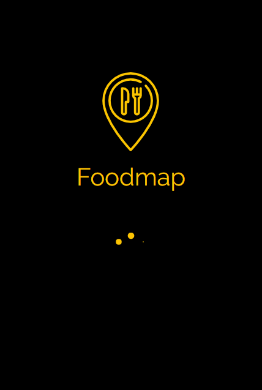
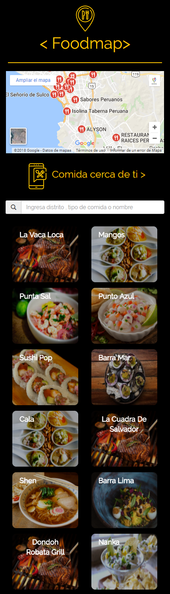

# Reto FOODMAP- MOBILE
---
## Objetivo

Crea una web-app que a través de un input pueda filtrar los restaurantes que se encuentran cerca de ti .

## Especificaciones Obligatorias

* Vista splash con duración de 2 a 5 segundos que redirecciona a tu vista principal. 
* En la vista principal se muestran todos los restaurantes "cerca de ti" junto con el input para filtrar tu elección (Los criterios de filtrado son decisión tuya, puede ser por tipo de comida, costos, orden alfabético, etc.).  
* Ya que se hizo la elección del filtro deben mostrarse únicamente aquellos restaurantes que cumplan con la condición. 
* Agrega un evento mouseover a las imágenes, lo que pase con el efecto es decisión tuya (Cambio de tamaño, muestra de texto, cambio de imagen, información, etc). 
* Al seleccionar alguno de los restaurantes, deberá mostrarse la información de este a través de un modal. 
* Una vez cerrado el modal debe volver a la vista principal. 

## Especificaciones para filtrar

* EL input filtra por distrito.
* Filtro  por tipo de comida : carne, marina, oriental o fusión.
* Por nombre e inicial del nombre del restaurante.

## Especificaciones de Desarrollo

* La página principal es denominada `index.html` en el cual se encuentra al vista splash solicitada  y se enlaza las hojas de estilos propias y las de Bootstrap.

* En la carpeta `css` se encuentra el archivo `main.css` donde se han agregado los  estilos necesarios para el proyecto.

* En la carpeta `vendors` se encuentran los archivos de Bootstrap y jquery.

* En la carpeta `js` se encuentran los archivos jquery por cada vista desarrollada.

* En la carpeta `views` se encuentran la vista principal del proyecto.

* En la carpeta `assets` se encuentra la carpeta `images` donde estan las imágenes necesarias para el proyecto.

* Esta web utiliza 1 tipografía :   `Raleway`.

* La paleta de colores se basa en estos tres : `fcc403` y   `#00000`.

* Los íconos se obtuvieron de  Bootstrap.

* En el desarrollo del proyecto se han utilizado diferentes tipos de efectos sobre algunos títulos e imágenes, todo esto especificado en la hoja de estilos main.css.

### Versión Mobile

#### Vista Splash

#### Vista 1

Realizado por Carla Centeno Ramos.
